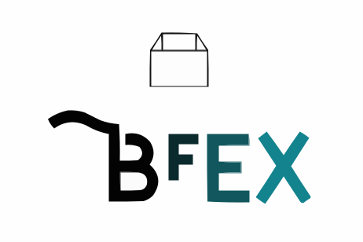

<br />
<br />

<p align="center">

</p>

<br />
<br />


# About dweb_bundle


[![Telegram Group][telegram-badge]][telegram-url]

[telegram-badge]: https://cdn.jsdelivr.net/gh/Patrolavia/telegram-badge@8fe3382b3fd3a1c533ba270e608035a27e430c2e/chat.svg
[telegram-url]: https://t.me/+SiZ53KtzsMw0M2Rl

DwebBrowser 前后端打包工具，把您开发的包打包成`.bfsa`形式。

### @bfex/bundle

```
 全局安装指令
 # npm方式
   npm i @bfex/bundle -g

 # yarn方式
   yarn global add @bfex/bundle
```

#### 使用

> bfex -V

```bash
0.0.3
```

---

> bfex help

```bash
Usage: bfex [options] [command]

.bfex application bundle service.

Options:
  -V, --version     output the version number
  -h, --help        display help for command

Commands:
  bundle [options]  bfex bundle project to .bfsa
  interactive       bfex bundle project to .bfsa by interactive command line
  help [command]    display help for command
```

---

> bfex bundle -h

```bash
Usage: bfex bundle [options]

bfex bundle project to .bfsa

Options:
  -f, --front-path <string>  frontend application path.
  -b, --back-path <string>   backend application path.
  -i, --bfs-appid <string>   bfsAppId: app unique identification，new app ignore.
  -h, --help                 display help for command
```

`-f` 前端项目打包地址

`-b` 后端项目打包地址

`-i` 已经上架的应用，需要传入 bfsAppId，避免重新生成新的 bfsAppId

## future

1. 链上 APPID 认证申请。
2. 上传到 DwebBrowser DAPP 商城。
